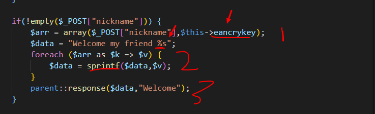
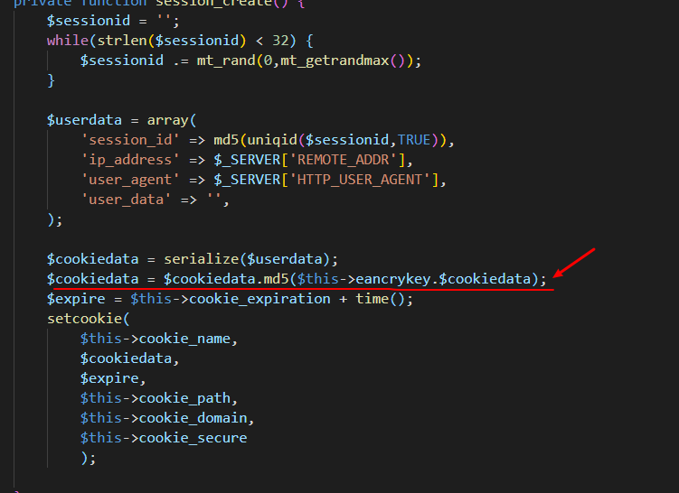
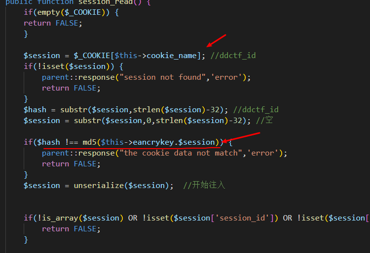
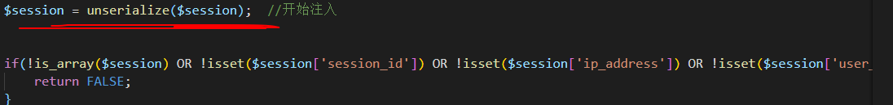
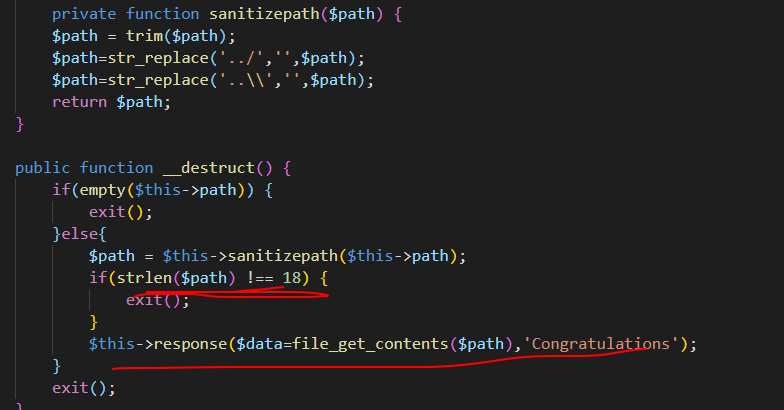
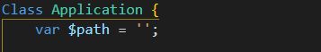
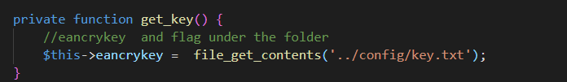
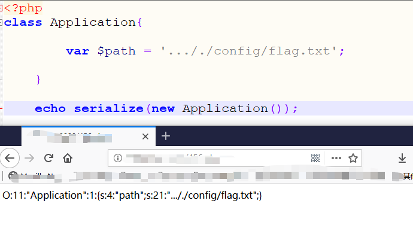
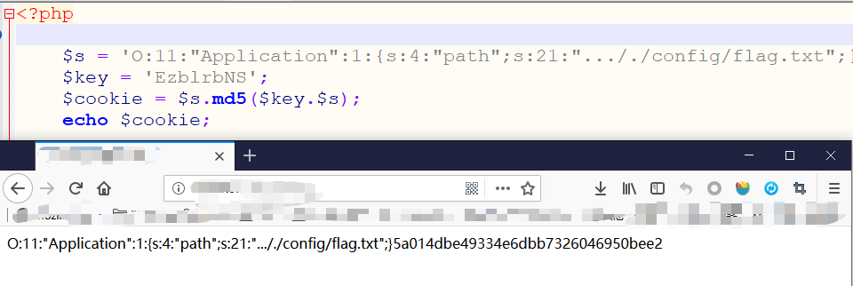
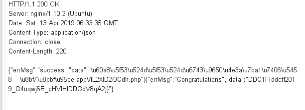

### WEB签到题

考点：php反序列化

----

### 得到源码

- 打开网页，在js代码可以看到它设置了一个请求头 ddctf_username，根据经验，我们赋值admin，就可以获得源码链接

### 分析源码

- 可以参考这边文章，对其机制有大概了解以及相关的漏洞利用
  - [文章链接](https://www.mehmetince.net/codeigniter-object-injection-vulnerability-via-encryption-key/)

### 利用思路

- 获得eancrykey，用eancrykey伪造cookie，反序列化，返回flag

### 利用过程

- 获得eancrykey

  - 利用其返回cookie带出eancrykey
  - 
    - post一个变量，把变量和eancrykey组成数组
    - 遍历这个数组，把每个值和句子拼接，注意sprintf这个函数
    - 我们可以赋值 nickname = xxx%s，**xxx%s**会在第一次替换friend后面的**%s**，生成Welcome my friend xxx%s，这一次的%s会被eancrykey替换，从而带出key。如果在提交参数是没有%s，第二次的eancrykey就没有位置替换，不能被带出

- 伪装cookie

  - 如果有cookie，它会进行检查，比对md5值，我们可以看一下cookie是怎样生成的
  - 
  - cookie检查
  - 
  - 这就是我们为什么要获得这个key
  - 
  - 在检查其他东西前，它会执行一段反序列化，在这一步我们就可以利用，从而下面的检查都没用
  - 怎么查看flag，在父类里有__destruct()
  - 
  - 只要我们给path赋值flag所在文件位置，就可以带出，看一下path
  - 
  - path为空，所以我们的目的是利用反序列化，给path赋值，再用eancrykey绕过md5检查，从而返回flag文件内容
  - flag所在文件内容，源代码给了提示  ../config/flag.txt
  - 
  - 伪造序列化字符串，注意是用 **..././***绕过检查
  - 
  - md5加密
  - 
  - 最后一步用post的方法，传nickname参数**xxx%s**，修改cookie为你的反序列化内容，不要忘记添加didictf_username头，成功读到cookie
  - 

  

