### 滴~（脑洞）

如何提高博客阅读量，这道题就是很好的例子

----

### 读取源码

- 提名的链接有点明显，稍微有点经验就会去测试一下
  - TmpZMlF6WXhOamN5UlRaQk56QTJOdz09

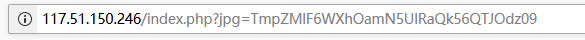

- 果然先经过两次base64，后一次hex，便可知道奥秘
  - 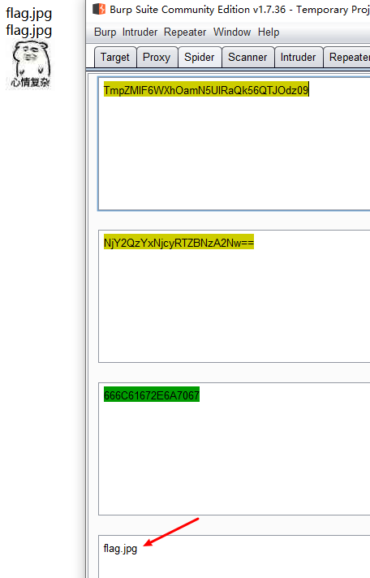
  - 初步判断可能有问包含
- 尝试读取index.php源码
  - 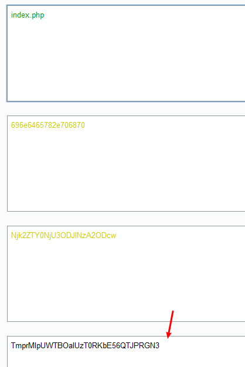
  - 提交
    - 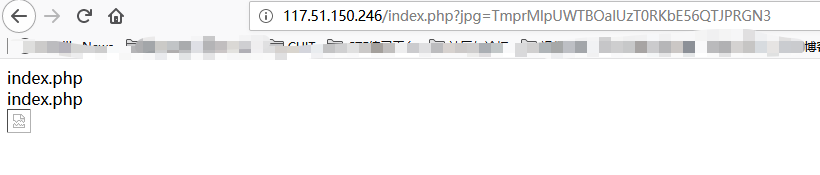
  - 查网页源代码，复制img标签源码，在浏览器中打开，注意data协议以文本形式查看
    - 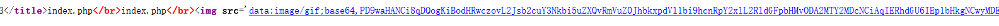
    - 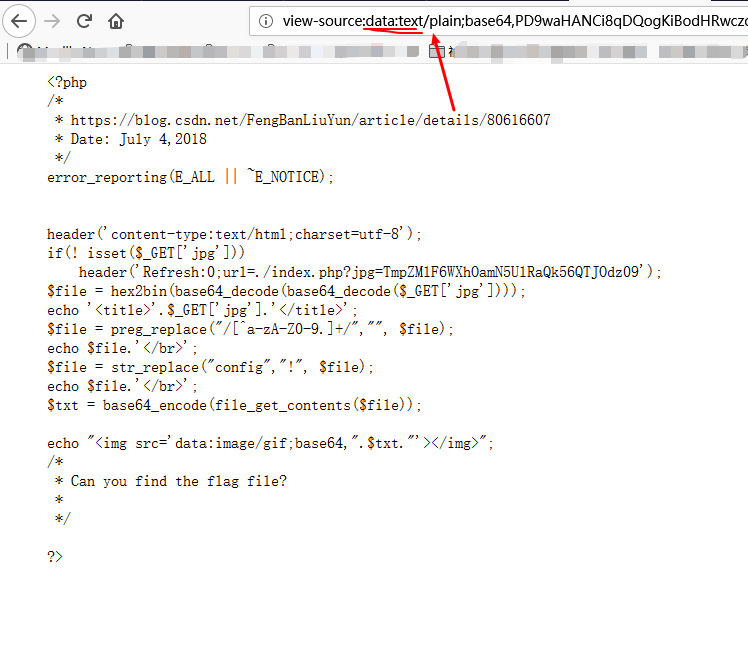
    - 好像没有什么好利用的，其他文件读不了

----

### 脑洞时间到

- 不要忽略源码前面的网址，竟然是个博客链接
  - 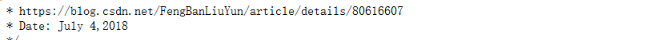
  - 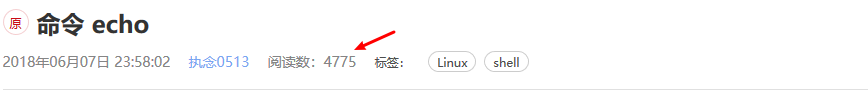
  - 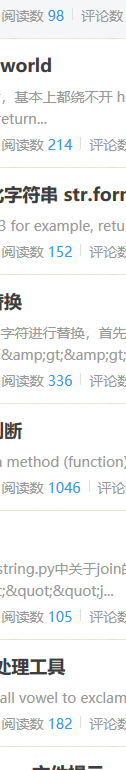
  - 对比博主其他文章，这个阅读量有点高
- 没发现再根据第二条提示，读取2018-7-14文章
  - 
  - 以为是swp文件泄露，找了，发现没有
  - 经过疯狂脑洞，你决定想不到他是暗示这个
    - 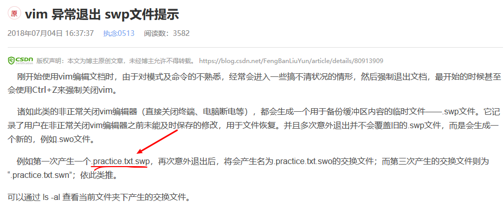
  - 读取到另一份源码
    - 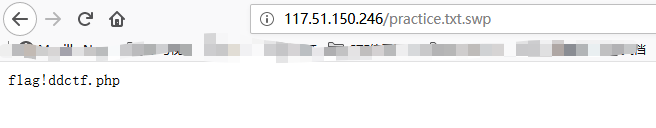
  - 根据index.php源码，可以了
    - 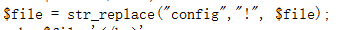
    - 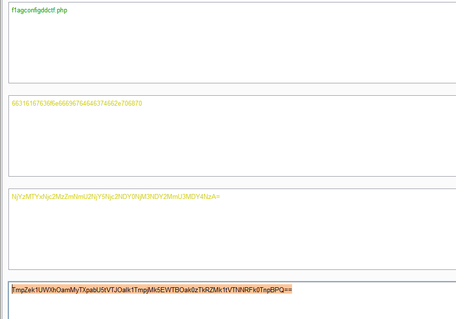
- 又来一份源码
  - 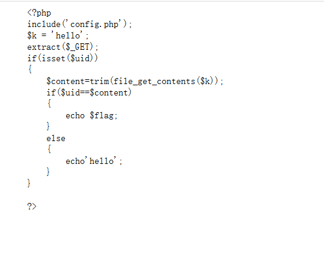
  - 幸好没多复制，简单变量覆盖
- 构造pyload读取filag
  - 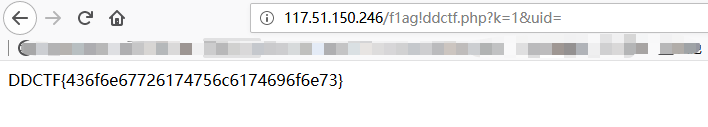